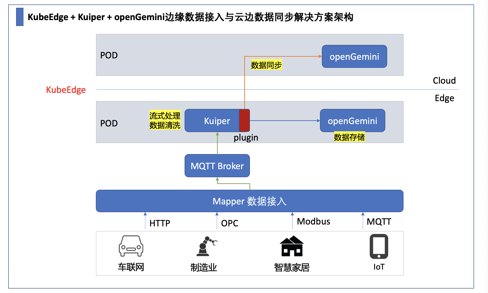

提高软件的可靠性和性能，同时在可能的情况下降低自己的成本，是企业和开发者长期追求的目标。边缘计算不失为一种好的方法，它在各行各业中得到了广泛应用。
## 边缘计算的优势
-	通过将处理和存储分散到各种设备中来提高安全性。
-	边缘计算提供更高的速度和更低的延迟，以实现更快的数据处理。
-	节省成本，边缘执行实时处理，将处理后的数据发送到云进行长期历史分析，以降低存储成本  

**在本文中，您将了解如何通过KubeEdge、Kuiper和openGemini的搭配实现边缘场景下数据的处理、存储和数据同步**
## KubeEdge是什么？
KubeEdge是一个开源系统，用于将容器化应用程序编排功能扩展到Edge的主机。它基于kubernetes构建，并为网络应用程序提供基础架构支持。云和边缘之间的部署和元数据同步。
为什么使用KubeEdge?
-	边缘计算
借助在Edge上运行的业务逻辑，可以让本地生成的数据，进行大量数据处理操作并对其进行保护。这样可以减少边缘和云之间的网络带宽需求和消耗，提高响应速度，降低成本并保护客户的数据隐私。
-	简化开发
开发人员可以编写基于HTTP或MQTT的常规应用程序，对其进行容器化，然后在Edge或Cloud中的任何一个更合适的位置运行应用程序。
-	Kubernetes原生支持
借助KubeEdge，用户可以像在传统的Kubernetes集群一样，在Edge节点上编排应用程序，管理设备并监视应用程序和设备状态。
-	丰富的应用
可以轻松地将现有的复杂机器学习，图像识别，事件处理等其他高级应用程序部署到Edge。
## Kuiper是什么？
LF Edge eKuiper 是 Golang 实现的轻量级物联网边缘分析、流式处理开源软件，可以运行在各类资源受限的边缘设备上。eKuiper 设计的一个主要目标就是将在云端运行的实时流式计算框架迁移到边缘端。eKuiper 参考了上述云端流式处理项目的架构与实现，结合边缘流式数据处理的特点，采用了编写基于源 (Source)，SQL (业务逻辑处理), 目标 (Sink) 的规则引擎来实现边缘端的流式数据处理。
## 为什么使用Kuiper?
-	Kuiper 支持MQTT协议的数据源，可以很方便的与KubeEdge MQTT broker搭档，屏蔽底层设备协议，完成数据交换
-	支持基于SQL的规则逻辑，用于清洗数据
-	支持多种Sink，并支持插件的方式扩展Sink
## 解决方案架构



## 安装部署
### 1. KubeEdge安装
参考 [https://kubeedge.io/en/docs/setup/keadm/](https://kubeedge.io/en/docs/setup/keadm/)，根据以往经验，尽量避免离线安装。
### 2. Kuiper安装
以Docker方式让 Kuiper 运行在边缘侧，参考：[https://ekuiper.org/docs/zh/latest/quick_start_docker.html](https://ekuiper.org/docs/zh/latest/quick_start_docker.html)  
注意事项：将步骤2中MQTT_SOURCE__DEFAULT__SERVER 的值按实际情况修改，配置为 KubeEdge MQTT broker
### 3. 安装Kuiper InfluxDB插件
参考[https://ekuiper.org/docs/zh/latest/rules/sinks/plugin/influx.html](https://ekuiper.org/docs/zh/latest/rules/sinks/plugin/influx.html)   

influxRule 规则配置示例：
```
{
    "id": "influx",
    //用于清洗数据的sql， from 语句对应mqtt的topic
    "sql": "SELECT * from demo_stream where temperature > 50",
    //支持配置多个action，将数据同时发往云端和边缘
    "actions": [
        {
            "log": {},
            "influx":{
                //openGemini 服务地址
                "addr": "http://xxx.xxx.xxx.xxx:8086",
                "username": "",
                "password": "",
                "measurement": "test",
                "databasename": "databasename",
                "tagkey": "tagkey",
                "tagvalue": "tagvalue",
                "fields": "humidity,temperature,pressure"
            }
        }
    ]
}
```
### 4. openGemini部署
openGemini部署到边缘的方式和普通的容器化部署方式大致是相同，差异点在于，边缘侧支持域名访问需要部署 EdgeMesh  
详情参考：  

EdgeMesh部署指南 [https://edgemesh.netlify.app/guide/](https://edgemesh.netlify.app/guide/)  
openGemini容器化部署指南 [https://github.com/openGemini/openGemini/blob/main/docker/README.md](https://github.com/openGemini/openGemini/blob/main/docker/README.md)
