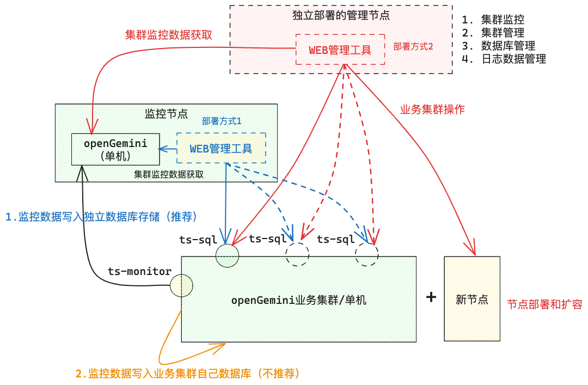

# openGemini WEB 管理工具总体需求梳理

## openGemini WEB 管理工具是什么？

数据库管理工具，**也就是大家熟识的数据库图形化工具**。数据库GUI工具是数据库人员必需的工具之一，根据这种工具，可以形象化方便快捷地查询数据信息，比如MySQL的DBeaver, phpMyAdmin，InfluxDB的InfluxDBStudio。但这些工具都是桌面GUI工具，主要功能是进行简单的数据库管理，比如通过客户端创建数据库，创建表，写入和查询数据等，让开发者从命令行工具中解脱出来。

WEB管理工具是一种流行趋势，除功能之外，WEB 管理工具最大的优势在于可以使用任何一款浏览器进行访问，而且还能跨端（手机、PC、平板都可以），比如InfluxDB的Chronograf, Docker的Portainer，此外还有Grafana。

openGemini WEB 管理工具定位是一款与openGemini时序数据库深度融合的、独立部署的、跨平台的综合WEB管理工具，包括工具配置、集群监控、数据库管理、日志管理、集群管理等功能。

## 整体部署架构图

## 工具配置

工具配置主要包括：

**添加集群信息：**

​	**业务集群名称：**管理多个集群时，用于区分

​	**业务集群的ts-sql节点IP：**多个ts-sql，用分号";"隔开，用于链接ts-sql进行探活和数据库操作

**监控节点IP(单机)：**监控节点上存储业务集群监控数据的数据库（openGemini单机）IP地址，如果监控数据存储在业务集群中，此项可不配置。

## 集群监控

第一阶段，固定监控几个黄金指标：cpu（分节点显示，可以合在一个图表中）、mem（分节点显示，可以合到一个图表中）、disk（分节点显示，可以合到一个图表中）、各节点健康状态（分集群显示）

cpu利用率（示例图）

节点健康状态（示例图）

第二阶段，支持添加自定义图表，比如用户想看看集群的入口流量，可以在管理工具上新创建一个图表，设置好查询语句即可。参考Grafana可自行添加监控图表（需要提前创建图表模板）

## 数据库管理

第一阶段：支持创建/删除数据库，创建/删除表，创建/修改/删除保留策略，写入数据（执行命令方式），数据检索（执行命令方式，数据分页显示），查询结果数据导出

第二阶段：支持数据导入导出，按节点粒度做数据备份恢复。

## 日志管理

集群错误日志查询（精确、模糊、正则）

## 集群管理

第一阶段，支持集群配置文件生成

第二阶段，支持集群自动安装部署，一键容器化部署（k8s），节点重启等。