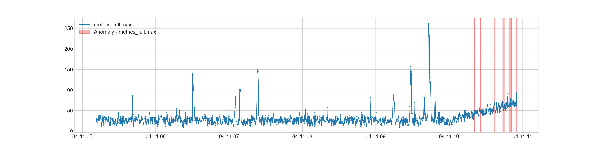

# openGemini-castor使用手册


## 概览

openGemini-castor是一个时序数据分析Python库。它提供了一个端到端的时序分析框架，组织多个算法及每个算法所需处理过程。可用于智能运维、物联网等场景，具备高效的实时数据分析和灵活的算法编排能力。


### 组件

openGemini-castor的检测流程包括多个组件：预处理器，异常检测器，告警抑制器，严重程度分级器。

* 预处理器：提供了重采样，平滑去噪，缺失值补齐等功能，完成时序数据的预处理。

* 异常检测器：针对数据突升突降，持续上升/下降，超过阈值等不同场景，使用不同的算法评估数据点是否异常。

* 告警抑制器：为了避免误报和重复告警，根据规则过滤单点出现，短时间内重复出现，原始值处于正常值范围等多种告警。

* 严重程度分级器：根据多种异常出现情况，按严重程度对异常进行分类。辅助开发者对故障严重程度的判断。

  

### 检测流程

检测流程是通过<a href="#jump2" target="_blank" rel="external nofollow" >PipelineDetector</a>类完成从时序输入到异常信息输出的整个过程。

通过配置参数可以灵活地配置上述4个组件，从而可根据需求制定相应的检测流程：

* 告警抑制器和严重程度分级器可以根据用户的需求选配，即检测流程可以不包含这些组件。
* 可以选择多个异常检测器，告警抑制器和严重程度分级器，组合到检测流程中。
* 告警抑制器可针对不同异常检测器进行配置。


### 流式检测

openGemini-casto架适用于流式数据检测，即连续接受新的数据点进行实时检测。多种异常检测器，告警抑制器和严重程度分级器组件对流式异常检测做了相应的支持。通过缓存少量数据，使得整个检测过程无需拉取大量的历史数据，降低异常检测的计算压力。

**并发流式检测**

随着信息技术的发展，数据的获取、存储能力不断增强，全球数据呈现爆发式增长。尤其在物联网和智能运维业务场景中，需要具备对海量数据进行实时分析的能力。

为了提高检测速度，支持千、万级指标同时进行流式检测，我们主要在以下方面进行了优化：

* 大规模输入：支持将多个指标的数据拼接为一个索引为时间戳的DataFrame作为输入
* 过滤已检测数据：已检测过的数据点会被过滤，避免重复检测
* 构造批量计算数据：根据各个指标的缓存数据与输入数据构造计算数据，使得后续检测操作可批量处理
* 不必要组件可选配：根据用户需求，可将告警抑制器和严重程度分级器从流程中取消，减少不必要的操作


## 异常检测器

在预处理后，异常检测器用于评估数据是否异常。为了应对数据突升突降，持续上升/下降，超过阈值等多种场景，openGemini-castor提供了多个异常检测器。在检测流程中，用户可以使用多个异常检测器获取多种异常。

本开源版本目前支持五种异常检测器："DIFFERENTIATEAD",  "BatchDIFFERENTIATEAD"，"IncrementalAD",  "ThresholdAD", "ValueChangeAD"。

### 功能介绍

1. **DIFFERENTIATEAD**：差分波动检测器

   用于检测数据随时间变化的波动是否存在异常。关注的异常包括：相对于历史数据，数据在短时间出现剧烈地上升或下降。比如，由于服务负载陡增导致的服务响应时间明显增加，需要运维人员关注。

   为了检测数据波动是否异常，"DIFFERENTIATEAD" 利用差分将原始数据转化为波动数据。并使用动态k-sigma实时计算阈值，对时序数据据做异常检测。即根据历史波动数据得到加指数权移动平均和标准差，从而通过k-sigma实时计算当前时间点波动的上下界限，判定当前数据点是否异常。该检测器适用于流式数据检测。

   检测器参数配置：

   ```yaml
   DIFFERENTIATEAD:
     # 不可配置
     algo: DIFFERENTIATEAD
     # 计算数据差分窗口长度。当数据小于window + 1时，会报数据不够error。不建议修改该配置
     window: 9  

     DYNAMIC_THRESHOLD:
       CHOICE: 'SigewmThresholder'
       SigewmThresholder:
         # 用于计算指数加权移动平均/方差的窗口大小。当数据>window时才会开始判断数据为异常。不建议修改
         window: 100 
         # 算法敏感度。该值越低阈值范围越小。根据指标偏离合理区间的容忍程度，可修改该配置
         sigma: 3 
   ```

   根据以上异常检测器配置，检测出突增异常点：

   

2. **BatchDIFFERENTIATEAD**：批量差分波动检测器

   用于检测数据波动（相对于输入数据整体）是否存在异常。关注的异常包括：相对于整体数据，数据在短时间剧烈地上升或下降。比如，由于与其他时间相比服务负载明显过高，导致服务响应时间剧烈增加，需要运维人员关注。

   与 "DIFFERENTIATEAD" 一样， 利用差分把非平稳数据转化为平稳数据。与 "DIFFERENTIATEAD" 不同的是，"BatchDIFFERENTIATEAD"不再实时计算门限， 而是通过k-sigma计算输入数据整体波动的阈值，从而对数据做异常检测。该检测器适用于批量数据检测，不适用于流式数据检测。

   检测器参数配置：

   ```yaml
   BatchDIFFERENTIATEAD:
     # 不可配置
     algo: BatchDIFFERENTIATEAD
     # 计算数据差分窗口长度。当数据小于window + 1时，会报数据不够error。不建议修改该配置
     window: 9  

     DYNAMIC_THRESHOLD:
       CHOICE: 'SigmaThresholder'
       SigmaThresholder: 
         # 算法敏感度。该值越低阈值范围越小。根据指标偏离合理区间的容忍程度，可修改该配置
         sigma: 3   
   ```
   根据以上异常检测器配置，检测出相对于整体数据的波动较剧烈的异常点：

   

3. **IncrementalAD**：持续增长检测器

   用于检测数据是否存在持续上升或下降趋势。关注的异常包括：数据在超过指定上限（或低于下限）的情况下，最大值（或最小值）长期地持续上升（或下降）。比如内存或磁盘等指标超过一定上限并持续上升，可以提前预判内存溢出或磁盘不够用的问题。

   为了检测持续增长，检测器将计算窗口分为大小为window_size的window_number个窗口。在原始值高于upper_bound（或低于lower_bound）的情况下，若window_number个窗口内的最大值（或最小值），持续在上升（或下降的话）则被视为异常。

   检测器参数配置：

   ```yaml
   # 该检测器的参数都需要跟根据持续上升或下降的特性进行配置
   IncrementalAD:
     # 切分窗口长度
     window_size: 20
     # 切分窗口个数
     window_number: 4
     # 在持续上升场景下，数据正常范围的上限。如果数值小于或等于upper_bound，数据不会被检测为异常。
     upper_bound: 1 
     # 在持续下降场景下，数据正常范围的上限。如果数值大于或等于lower_bound，数据不会被检测为异常。
     lower_bound: 0  
   ```
   根据以上异常检测器配置，检测出持续增长异常点：

   

4. **ThresholdAD**：阈值检测器

   用于检测数据是否超过（或低于）上限阈值（或下限阈值）。关注异常包括：数据超过指定上限阈值、低于指定下限阈值等指标明显超过正常值范围的情况。比如，机器温度超过可承受范围，需要立即进行检修。

   检测器参数配置：

   ```yaml
   ThresholdAD:
     # 上限阈值。根据需要的上限，可配置该参数
     upper_bound: 80  
     # 下限阈值。根据需要的上限，可配置该参数
     lower_bound: 60
     # 不可配置
     window: 0
   ```
   根据以上异常检测器配置，检测出办公室温度超过80华氏度或低于60华氏度的异常点：

   

5. **ValueChangeAD**：数值变化检测器

   用于检测数据是否发生过变化，即指标状态不一致的情况。关注的异常包括：当前数据与前一个点的数据不一致。比如：进程号变化，即进程已经挂掉的情况。

   检测器参数配置：

   ```yaml
   ValueChangeAD:
   # 不可配置  
       window: 1
   ```


   根据以上异常检测器配置，检测进程号发生变化的异常点：


## 告警抑制器

告警抑制器是异常检测后的异常结果处理过程，它将抑制误触发或频繁的异常告警。这些抑制器可以根据不同的需求进行配置与组合。

### 功能介绍

1. **连续异常抑制** (ContinuousAnomalySuppressor)：抑制同一类型故障的连续报警

   在检测过程中，由于每一种故障会持续一段时间，同一种类型故障会出现重复报警的情况。因此，需要抑制重复报警，从而减少过多的报警次数，避免告警风暴。

   具体操作：如果当前数据点距离上一次告警的时间间隔小于gap，则将抑制该异常。

   告警抑制器参数配置：

   ```yaml
   ContinuousAnomalySuppressor:
     # 上一次发生告警后再一次触发告警的最短时间间隔
     gap: "6T"
   ```

2. **瞬时异常抑制**（TransientAnomalySuppressor）：抑制瞬间出现的告警

   由于数据的抖动或者业务的变化，可能发生只有一个时间点出现异常的情况。比如内存只在一个时间点突变为80，下一个时间点马上变为正常值。该场景可被认为是正常情况，只有连续出现异常才能说明系统指标真正地出现了异常。当异常累积发生到在window长度的窗口中发生anomalies个告警后才触发告警。

   具体操作：将window大小的连续窗口内出现次数小于anomalies个数的异常判定为正常数据

   告警抑制器参数配置：

   ```yaml
   TransientAnomalySuppressor:
     # 窗口大小
     window: 5
     # 窗口中异常个数
     anomalies: 3
   ```

3. **变化率抑制**（VariationRatioSuppressor）：抑制变化率较低的异常

   由于存在数据较为平稳的情况，可能微小的抖动也会使得相对波动变得很剧烈。因此，需要将变化率较低的异常抑制掉。

   具体操作：如果当前数据变化率低于前 history_length 个点的平均值的 ratio_threshold 倍，则抑制该异常。

   告警抑制器参数配置：

   ```yaml
   VariationRatioSuppressor:
     # 变化率门限，超过这个门限才告警
     ratio_threshold: 0.1
     # 原始值变化率历史对比窗口
     history_length: 50
   ```

   

4. **上下限抑制**（LowerBoundSuppressor）：抑制低于上限并高于下限的异常

   由于在特定范围内数据发生变化不足以引起我们的关注。比如，CPU的值在0-20内发生的变化，不足以引起系统的故障。因此需要抑制原始值在特定范围内的异常。

   具体操作：若原始值低于上限并高于下限，则抑制该异常。

   告警抑制器参数配置：

   ```yaml
   LowerBoundSuppressor:
     # 告警抑制上限，超过这个上限才告警
     upper_bound: 15
     # 告警抑制下限，低于这个下限才告警
     lower_bound: 1
   ```

### 使用方式

为了完成多种抑制，多种告警抑制器可以串行组合在一起。由于不同的异常类型需要不同的抑制器，需针对不同的异常检测器组合不同的告警抑制器。

1. 给特定的检测器配置告警抑制器：

   ```yaml
   # suppressor for ThresholdAD anomaly detector
   ThresholdAD:
     TransientAnomalySuppressor:
         window: 5  
         anomalies: 2  
     ContinuousAnomalySuppressor:
     gap: "30T"
   ```

2. 除了特定的检测器，其余的会使用通用告警抑制器

   ```yaml
   # suppressor for common anomaly detector
   common:
     LowerBoundSuppressor:
       upper_bound: 15
       lower_bound: 1
   
     VariationRatioSuppressor:
       threshold: 0.1
       history_length: 50
   
     TransientAnomalySuppressor:
       window: 5
       anomalies: 2
   
     ContinuousAnomalySuppressor:
       gap: "10T"
   ```


## 严重程度分级器

在告警抑制后，可得到最终的异常标签。根据多种异常出现的模式，严重程度分级器会对异常进行分类。辅助开发者对故障严重程度的判断。严重程度级别分别由 0，0.85，1来表示，数值越高严重程度级别越高。目前版本主要有两种分级方式：

1. 根据历史异常出现频率分级

   数据被检测出的异常频率是不同的，可能出现长时间只检测出一个异常，或每天都会检测出一个异常的情况。需要根据历史出现的频率判定严重程度。因此，如果过去特定时间间隔内从未出现异常，则认为异常相对更严重。

   参数配置：

   ```yaml
   his_anomaly:
     # 历史时间间隔
     gap: "2D"   
   ```

2. 根据异常检测器分级

   如上文所说的那样，针对不同的异常类型，需要使用不同的异常检测器。因此不同检测器检测出的异常也对应不同程度的异常级别。比如，"DIFFERENTIATEAD" 检测突升突降的异常，"IncreamentalAD" 检测持续上升或下降的异常。跟 "DIFFERENTIATEAD" 相比，"IncreamentalAD" 检测出的异常，有更大概率会对业务产生严重的影响，因此对应更高的严重程度级别。当然，用户可以根据自己的需求定制异常检测器所对应的异常程度等级。

   参数配置

   ```yaml
   algo: 
     ThresholdAD: 1
     Incremental: 0.85
     DIFFERENTIATEAD: 0
     ValueChangeAD: 1
   ```

不同的分级方式可以通过配置参数进行配置。多个分级方式得到的结果会被合并，得到最终的结果。配置方式：

```yaml
Severity_Level:
  # parameters for SeverityLevelByAlgo
  algo: 
    ThresholdAD: 1
    Incremental: 0.85
    DIFFERENTIATEAD: 0
    ValueChangeAD: 1
  # parameters for SeverityLevelByHistoryAnomaly
  his_anomaly:
    # historical time gap
    gap: "2D"
```


## 检测接口

<p id="PipelineDetector" > 

>  class **<castor.detector.pipeline_detector.PipelineDetector**(*algo: List[str], params: dict = None*):

</p>

PipelineDetector可组合多个组件（预处理器，异常检测器，告警抑制器，严重程度分级器），将它们编排成一个完整的检测流程。

* **Parameters**
  * **algo**: (list) - 指定多个检测算法。
  * **params**: (dict）- 指定组件组合方式的参数，即配置参数。详见conf目录下的detect_base.yaml文件中的注释

* **run**(*data: pd.DataFrame*)

  根据配置参数组合检测流程，完成流程中预处理和异常检测等步骤，得到最后的异常信息。

  * Parameters:
    * data: (pd.Dataframe) - 用于检测的数据，其index为时间戳。
  * Return type：List[TimeSeriesType]
  * Return: [TimeSeriesType](#TimeSeriesType)列表。列表的每个元素表示不同检测算法的结果，包含了原始数据和异常信息。

* **fit**(*data: pd.DataFrame*)

  使用输入数据训练pipeline中的所有算法模型

  * Parameters:
    * data: (pd.Dataframe) - 用于训练的数据，其index为时间戳。

* **fit_run**(*data: pd.DataFrame*)

  使用输入数据训练pipeline中的所有算法模型，然后根据配置参数组合检测流程，完成流程中预处理和异常检测等步骤，得到最后的异常信息。

  * Parameters:
    - data: (pd.Dataframe) - 用于训练并检测的数据，其index为时间戳。
  * Return type：List[TimeSeriesType]
  * Return: [TimeSeriesType](#TimeSeriesType)列表。列表的每个元素表示不同检测算法的结果，包含了原始数据和异常信息。

* 

<p id="TimeSeriesType" > 

> TimeSeriesType

</p>

​	时间序列类型：Dict[str, pd.DataFrame] 的别名


## 举例

在本章节的例子中，我们通过[PipelineDetector](#PipelineDetector)类选择 "DIFFERENTIATEAD"和 "ThresholdAD" 异常检测器，检测并展示异常检测结果。

1. 加载检测数据

   ```python
   import pandas as pd
   data = pd.read_csv("./tests/data/fluctuate.csv", index_col="time", parse_dates=True)
   ```

   输入数据格式：带有时间戳索引的DataFrame，每一列代表一个指标的数据

   <font size=1>

   ```
                   			 metrics_full.max
   time                                 
   2022-04-11 05:11:00           27.1622
   2022-04-11 05:11:15           27.9514
   2022-04-11 05:11:30           23.6206
   2022-04-11 05:11:45           30.5120
   ...                               ...
   2022-04-11 10:55:30           60.5115
   ```

   </font>

2. 加载配置参数

   为了得到配置参数，你既可以创建一个新的字典对象也可以加载配置文件。

   detect_base.yaml：包含完整的默认参数配置文件。

   detect_base_without_suppressor.yaml：取消了告警抑制器配置的配置文件。

   ```python
   from castor.utils.base_functions import load_params_from_yaml
   params = load_params_from_yaml("./conf/detect_base.yaml")
   none_suppress_params = load_params_from_yaml("./conf/detect_base_without_suppressor.yaml")
   ```

3. 初始化并检测

   初始化过程中，需要指定方法 ["DIFFERENTIATEAD", "ThresholdAD"] 和配置参数 (none_suppre_params);

   在检测过程中，需输入被检测时序数据。

   ```python
   from castor.detector.pipeline_detector import PipelineDetector
   algo_list = ["DIFFERENTIATEAD", "ThresholdAD"]
   pipeline_detector = PipelineDetector(algo_list, none_suppress_params)
   results = pipeline_detector.fit_run(data)
   ```

   输出：包含两个异常检测器各自对应的异常信息，每一个异常检测器所对应的结果都包含了异常标签，原始数据，异常严重程度分级信息。

   <font size=1>

   ```
   [{'anomalyLabel':                  metrics_full.max
   	time                                 
   	2022-04-11 05:13:15             False
   	2022-04-11 05:13:30             False
   	...                             ...
   	2022-04-11 10:55:15             True
   	2022-04-11 10:55:30             False

    	, 'originalValue':              ...
   	, 'anomalyLevel':               ...
   },
   {'anomalyLabel':                  ...
   	...
   },]
   ```

   </font>

4. 获取异常标签

   由于在检测时，没有进行告警抑制，这里获得的异常标签是完整的，即异常检测器检测出的异常都会显示。

   由于指定了两个检测器，结果中包含了两个异常检测器的异常信息：

   ```python
   from adtk.visualization import plot
   import matplotlib.pyplot as plt
   for algo, anomalies in zip(algo_list, results):
       labels = anomalies.get(con.LABEL)
       ax = plot(data, anomaly=labels, anomaly_color="red", ts_linewidth=1, ts_markersize=3)
       ax[0].set_title(algo)
   plt.show()
   ```

   

   

5. 获取抑制后的异常标签

   为了过滤误报和重复的告警，可配置相应的告警抑制器参数，用params配置参数举例。

   由于当前版本支持流式检测，即连续性查询，相同数据的多次检测之间有影响（后续开源版本中将增加对非连续性查询的支持）。因此，为了实现单独的一次查询，需要清理缓存：

   ```python
   from castor.detector.cache.organize_cache import clear_cache
   clear_cache()
   ```

   params中的配置分别对 common 检测器和 "ThresholdAD" 检测器都设置了相应的告警抑制器。由于没有为 "DIFFERENTIATEAD" 检测器单独配置告警抑制器，"DIFFERENTIATEAD" 检测器的输出使用common对应的告警抑制器。

   ```python
   pipeline_detector = PipelineDetector(algo_list, params)
   results = pipeline_detector.fit_run(data)
   for algo, anomalies in zip(algo_list, results):
       labels = anomalies.get(con.LABEL)
       ax = plot(data, anomaly=labels, anomaly_color="red", ts_linewidth=1, ts_markersize=3)
       ax[0].set_title(algo)
   plt.show()
   ```

   

   从结果中可以看到大量的误报以及重复告警已被过滤。

   

