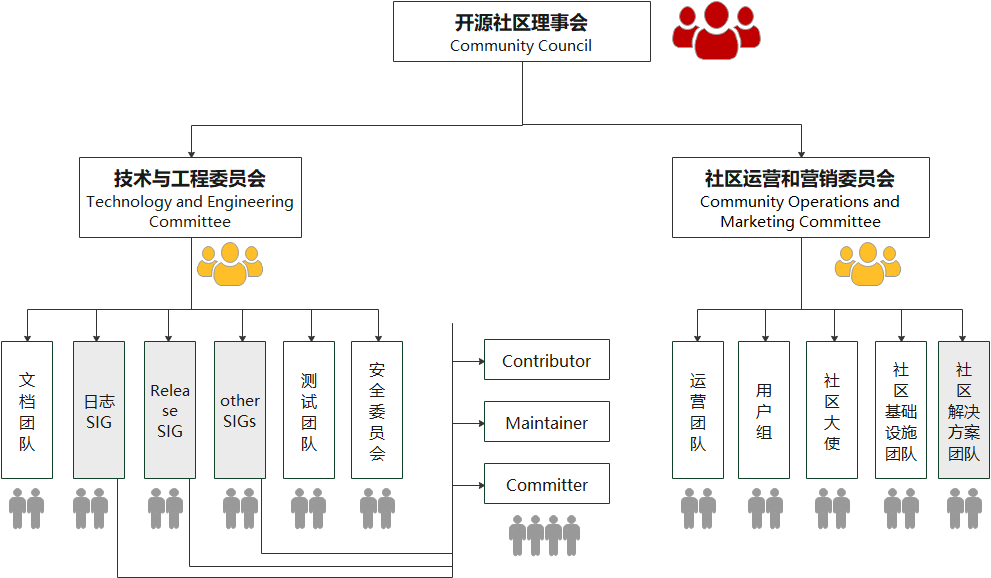

# openGemini社区组织架构和社区制度

## openGemini 社区管理

### 一、组织架构

本开源社区组织中，openGemini 开源社区工作理事会（简称 ，openGemini 理事会）为本开源社区最高决策机构，负责本开源社区的重大决策。
openGemini 理事会设 openGemini 理事会主席一名，openGemini 理事会主席系 openGemini 理事会委员之一，负责指导 openGemini 理事会决策的执行，openGemini 理事会主席为本社区的主要负责人；openGemini 理事会设技术与工程委员会，负责本社区技术决策；设社区运营和营销委员会，负责“openGemini”相关运营工作和营销工作。
本开源社区治理架构如下图：

### 二、权限划分

#### (一)  openGemini 理事会

1、openGemini 理事会是本社区所有业务决策的最高决策机构，对包括但不限于制定及修改本社区开源治理制度、决定重大业务活动计划、制定及调整社区的重大方向、社区的中止或终止、审定年度收支预算及决算及年度财务审计报告负全责。openGemini 理事会的成员个人及其委派单位对 openGemini 理事会做出的业务决策承担责任。

openGemini 理事会职责和权利包括但不限于：

(1)制定、修改本社区开源治理制度，由 openGemini 理事会制定的社区管理制度是本社区开放治理基本纲领；
(2)决定重大业务活动计划，包括社区资金筹集、财产管理和使用计划、社区年度活动计划等；
(3)制定及调整社区的重大方向，社区的中止或终止；
(4)审定社区年度收支预算及决算、年度财务审计报告；
(5)决定社区的知识产权授权管理，包括项目/子项目名称及品牌等；
(6)决定聘选和任免 openGemini 理事会委员；
(7)选举 openGemini 理事会主席；
(8)审议社区各下设组织的主席的选举和罢免；
(9)审议各下设组织的工作报告和问题；
(10) openGemini 理事会可进一步根据工作需要，经合法流程授权相关委员会、工作组和/或具体人员承担相应业务职责;
(11)成立专家顾问委员会，任免专家顾问委员会委员。

#### (二)  openGemini 理事会主席

1、  openGemini 理事会主席行使下列职权：

(1)  在 openGemini 理事会会议上检查 openGemini 理事会决议的落实情况；

(2)  技术与工程委员会主席、社区运营和营销委员会主席、提名委员会委员在选举过程中出现因为票数相同无法确定人选的情况，由上一届 openGemini 理事会主席裁决选举结果；

(3)  经 openGemini 理事会授权，在被授权范围内代表社区签署文件。openGemini 理事会主席有权在被授权范围内自主决定授权方式和范围。

#### (三)  技术与工程委员会

1、  openGemini 理事会下设唯一的技术与工程委员会。技术与工程委员会是本社区的技术领导机构。在合法合规并严格遵循相关制度规定的前提下，依照该社区开源治理制度开展工作。

2、  技术与工程委员会下设7个小组（暂定）

(1)   文档团队

(2)   Kernel SIG

(3)   Release SIG

(4)   Cloud Native SIG

(5)   IoT SIG

(6)   测试团队

(7)   安全团队

3、  技术与工程委员会的工作如下：

(1)   讨论决策社区技术发展方向和愿景；

(2)   讨论和决策社区的重大技术事项；

(3)   决策 SIG（Special Interest Group 特别兴趣小组）的成立和撤销，审视和辅导 SIG 组的日常工作，审视 SIG 组 Maintainer 的履职情况，协调 SIG 间技术合作；

(4)   落实社区日常开发工作，保证开源项目高质量发布；

(5)   协调社区其他组织结构的共性反馈并组织技术讨论，协调社区技术发展和用户需求的关系；

(6)   孵化技术创新项目，构建社区的技术影响力；

(7)   其他对社区有重要影响的技术工作。

#### (四)  社区运营和营销委员会

1、  openGemini 开源社区设社区运营和营销委员会。社区运营和营销委员会是运营和营销的领导机构，须严格依照openGemini 社区运营和营销相关制度中的管理规定开展工作。

2、  社区运营和营销委员会下设5个小组

(1)   运营团队

(2)   用户组

(3)   社区大使

(4)   社区基础设施团队

(5)   社区解决方案团队

3、  社区运营和营销委员会的工作如下：

(1)   推广以及运营 openGemini 开源社区的项目，打造 openGemini 品牌影响力；

(2)   引导 openGemini 开源社区的开源项目被广泛使用，构建 openGemini 全球生态；

(3)   讨论决策社区运营和营销的方向和策略；

(4)   开展形式多样的技术营销活动，组织用户案例、解决方案和开源社区的宣传活动；

(5)   其他对社区有关的品牌工作。

### 三、选举/任命/决策机制

#### (一)  openGemini 理事会委员

1、  理事会委员任命

openGemini 理事会由成员单位委派的代表及作为委员会委员的自然人共同组成，负责处理 openGemini 理事会日常事务并对本项目群进行开放治理。openGemini 理事会委员应具备以下条件：
(1)具有完全民事行为能力；
(2)遵守法律法规及相关制度；
(3)热心公益事业，自愿为本项目服务；
(4)具有较强的公益责任意识，能够遵循公平、公正、公开的原则，独立、客观、谨慎地参与议事决策；
(5)能够为本社区筹划、捐款、管理做出贡献；
(6)相关法律法规或相关制度要求需满足的其他条件。

2、  理事会委员任职规则

(1)openGemini 理事会委员每届任期为两年。
(2)openGemini 理事会委员（含 openGemini 理事会主席）所在成员单位应向基金会秘书处提交代表授权书，前述代表应向基金会提交书面任职承诺书和信息备案表，履行应尽工作职责。

3、  决策机制

(1)openGemini 理事会每个委员享有一票投票权。openGemini 理事会召开会议决策事项至少需由 openGemini 理事会到会委员半数以上（含）投票通过。为免疑义，若 openGemini 理事会委员同时担任 openGemini 理事会主席或副主席的，则该委员共计享有一票投票权。

(2)投票分为赞同、反对和弃权，投票模式为公开记名投票。

(3)openGemini 理事会委员委托他人代理参会的，该被委托人不得参与本次会议投票表决。

(4)如果需要，openGemini 理事会会议决策也可以采用在线投票的方式进行，在投票启动后 5 个工作日内为投票时间，超过投票时间没有投票的记为弃权，投赞成票的委员需要超过 openGemini 理事会委员数量的半数方为投票通过；如果在投票启动后 5 个工作日内参与投票的委员没有超过半数的，则需要重新发起投票。

(5)以下事项需 openGemini 理事会全体委员三分之二（含）以上投票通过方为有效：

a.制定、修改本项目群治理制度；

b.项目群中止、项目群重大方向的制定与调整及项目群终止；

c.审批各下设机构成员的任命和罢免；

d.决定重大业务活动计划，包括项目群资金筹集、管理和使用计划、品牌授权管理制度、项目群年度活动计划。

#### (二)  openGemini 理事会主席

1、  选举

由 openGemini 理事会委员成员中选举产生。openGemini 理事会设主席一名，副主席若干名。openGemini 理事会主席和副主席作为 openGemini 理事会委员，在 openGemini 理事会各享有投票权。

2、  任职规则

openGemini 理事会主席和副主席必须符合以下条件：
(1)具有完全民事行为能力；
(2)在社区业务领域内有较大影响力；
(3)应当遵守法律法规和本社区治理相关规定；
(4)openGemini 理事会主席每届任期 2 年，最多可连任两届。openGemini 理事会副主席每届任期 2 年，可连选连任。

#### (三)  openGemini 技术与工程委员会

1、  技术与工程委员会委员选举

技术与工程委员会需要选举产生的新委员由技术与工程委员会选举人投票选举产生技术与工程委员会委员对 openGemini 开源社区技术方向负责，受 openGemini 开源社区全体成员监督。
需通过选举产生的技术与工程委员会委员候选人必须是现任 openGemini 项目群的 SIG/子项目 Maintainer，并通过以下方式产生：
a.由项目群战略、捐赠人根据权益提名；
b.或技术与工程委员会提名；
c.或自荐，需获得至少五名技术与工程委员会现任委员书面推荐；

2、  技术与工程委员会主席选举

技术与工程委员会主席在技术与工程委员会委员中投票选举产生，经 openGemini 理事会审议后任命。

3、  技术与工程委员会任职规则

技术与工程委员会由下列人员组成：技术与工程委员会主席一名，下设的各小组 Maintainer 担任的委员若干名，以及其他需要选举产生的委员若干名。
技术与工程委员会委员每届任期为两年。技术与工程委员会主席最多可连任两届，由下设的各小组 Maintainer 担任的委员及其他需要选举产生的委员无任期限制。

4、  技术与工程委员会决策机制

a.超过三分之二技术与工程委员会委员与会的会议为有效会议；与会形式包括现场与会、线上接入等可以核实身份的多种形式。
b.不可委托他人代理参会并进行表决；
c.投票分为赞同、反对和弃权，投票模式为公开记名投票；
d.在会议上进行投票时，与会委员过半数投赞同票则通过决议；
e.如果需要，技术与工程委员会会议决策也可以采用在线投票的方式进行，在投票启动后 5 个工作日内为投票时间，超过投票时间没有投票的记为弃权，投赞成票的委员需要超过技术与工程委员会全体委员数量的半数方为投票通过；如果在投票启动后 5 个工作日内参与投票的委员没有超过半数的，则需要重新发起投票;
f.凡需要技术与工程委员会决议的事宜，均需要在技术与工程委员会会议上进行投票决策；
g.列席技术与工程委员会的顾问，可发表意见，但无表决权。

#### (四)  openGemini 社区运营和营销委员会

1、  社区运营和营销委员会委员任命

社区运营和营销委员会委员由 openGemini 委员会确定名额，由项目群战略捐赠人依据权益提名，经资格审查后任命。社区运营和营销委员会委员对 openGemini 开源社区的运营和营销工作负责，受 openGemini 开源社区全体成员监督。

2、  社区运营和营销委员会主席选举

社区运营和营销委员会主席在社区运营和营销委员会委员中投票选举选出，经 openGemini 委员会审议后任命。

3、  社区运营和营销委员会任职规则

社区运营和营销委员会由下列人员组成：委员会主席一名，委员若干名。社区运营和营销委员会委员每届任期为两年。社区运营和营销委员会主席最多可连任两届，委员无任期限制。

4、  社区运营和营销委员决策机制

a.超过三分之二社区运营和营销委员委员与会的会议为有效会议;与会形式包括现场与会、线上接入等可以核实身份的多种形式；
b.不可委托他人代理参会并进行表决；
c.投票分为赞同、反对和弃权，投票模式为公开记名投票；
d.在会议上进行投票时，与会委员过半数投赞同票则通过决议;
e.如果需要，社区运营和营销委员会议决策也可以采用在线投票的方式进行，在投票启动后 5 个工作日内为投票时间，超过投票时间没有投票的记为弃权，投赞成票的委员需要超过社区运营和营销委员全体委员数量的半数方为投票通过；如果在投票启动后 5 个工作日内参与投票的委员没有超过半数的，则需要重新发起投票;
f.凡需要社区运营和营销委员决议的事宜，均需要在委员会会议上进行投票决策；
g.列席社区运营和营销委员的顾问，可发表意见，但无表决权。

 