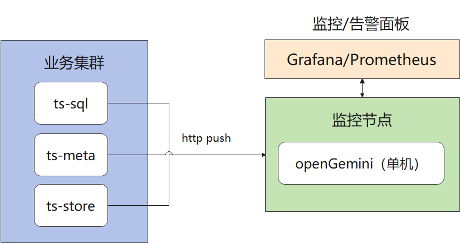
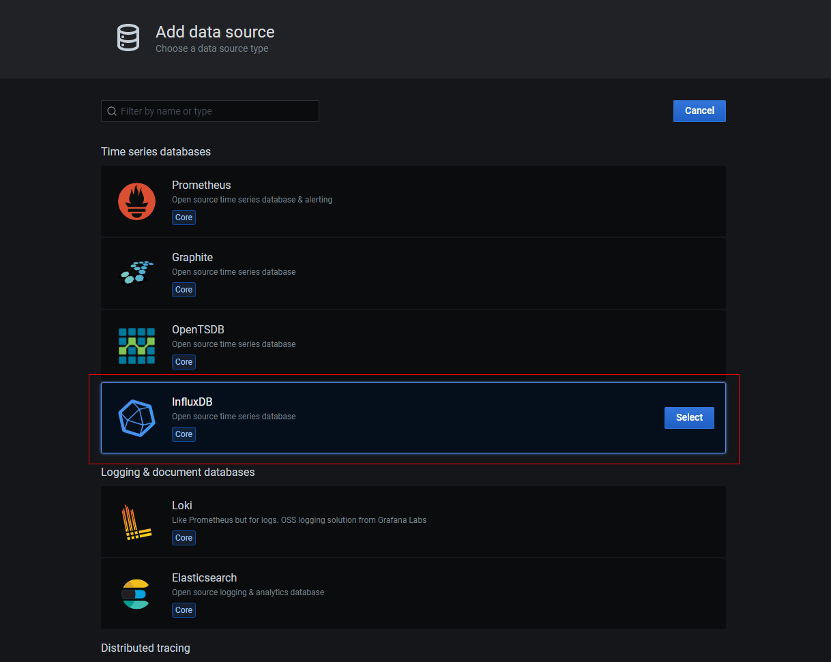
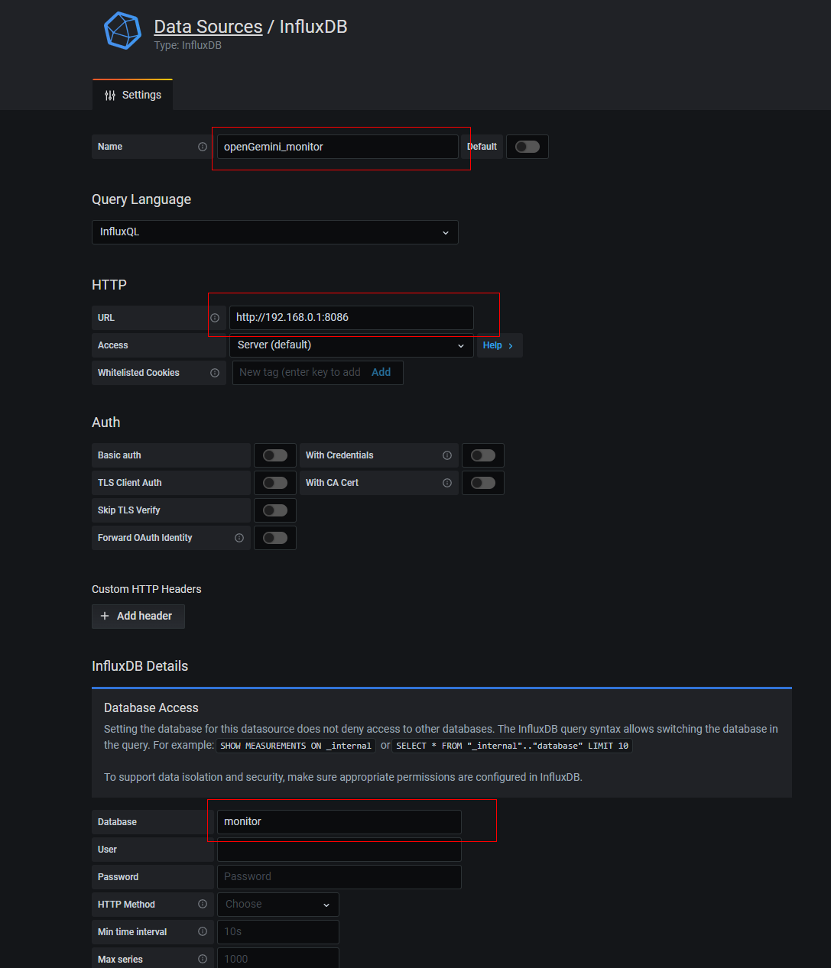
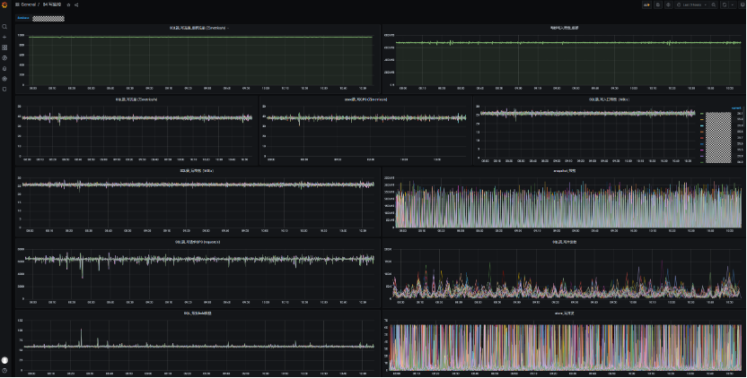

openGemini提供了260+项内核运行状态和设备运行监控指标，来满足我们日常的监控告警需求和帮助问题定位。本文介绍如何采集和查看这些监控指标项。若文档有任何问题，请及时给社区提issue反馈。

##  方式一：openGemini直接push指标到外部监控节点


如上图所示，我们建议在单独的节点上部署单机版openGemini，用于保存业务集群的各个监控指标数据，并通过Grafana或者Prometheus进行数据展示、告警等。如果业务集群可以直连监控节点，可以采用这种方式，但是会缺乏一些监控指标，比如磁盘空间利用率、创建的表总数、时间线数量、创建的数据库总数等。

### openGemini配置

openGemini.conf中monitor必要配置如下：

```c
[monitor]
  pushers = "http"
  store-enabled = true
  store-database = "_internal"
  store-interval = "10s"
  http-endpoint = "addr:8086"
```

配置说明：

pushers: 数据输出方式, 有http和file两种，当前这种方式下，选择http；

store-enabled：设置为true，打开监控。关闭则设置为false

store-database：监控数据需要写入到监控节点上单机openGemini的数据库名，需提前创建相关数据库。

store-interval： 指标采集周期；

http-endpoint：监控节点上部署的单机openGemini的监听地址和端口

 

如果业务采用单机版openGemini，也可以参考如上monitor配置。


## 方式二：指标数据通过ts-monitor采集并push到外部监控节点


如上图所示，内核产生监控日志log Files，然后通过ts-monitor采集并上报到监控节点。

### openGemini配置

openGemini.conf中monitor必要配置如下：

```c
[monitor]
  pushers = "file"
  store-enabled = true
  store-interval = "10s"
  store-path = "/home/openGemini/metric/metric.data"
```

配置说明：

pushers：数据输出方式, 有http和file两种，当前这种方式下，选择file

store-enabled：设置为true，打开监控。关闭则设置为false

store-interval：指标采集周期

store-path：当前方式下，指标数据会写入到文件，这里配置文件的保存路径

### ts-monitor配置

ts-monitor的配置文件是 config/monitor.conf

```
[monitor]
  # 【必填】填写当前节点的ip地址或者可以唯一标识该节点的信息，比如hostname
  host = "{{addr}}"

  # 【必填】ts-monitor采集数据的目录，与前面的store-path配置保持一致
  metric-path = "/tmp/openGemini/metric"

  # 【必填】ts-monitor会采集错误日志，与openGemini.conf -> [logging] -> path的配置保持一致
  error-log-path = "/tmp/openGemini/logs"

  # 【选填】如果当前节点没有部署ts-store组件，可注释，不填写。ts-monitor监测数据存放目录大小，监控磁盘空间利用率。
  #  与openGemini.conf -> [data] -> store-data-dir 的配置保持一致
  disk-path = "/tmp/openGemini/data"
  
  # 【选填】如果当前节点没有部署ts-store组件，可注释，不填写。ts-monitor监测WAL文件存放目录大小，监控磁盘空间利用率。
  #  与openGemini.conf -> [data] -> store-wal-dir 的配置保持一致
  aux-disk-path = "/tmp/openGemini/data/wal"
  
  # 【必填】填写当前节点上已部署openGemini的组件，用逗号分隔，例如“ts-sql,ts-meta”,"ts-sql,ts-meta,ts-store"
  process = "ts-store,ts-sql,ts-meta"
  # 【可保持默认配置】history保存当前已经采集过的文件信息，防止ts-monitor重启后全部文件再此重复采集，可保持默认配置
  history-file = "history.txt"
  # Is the metric compressed.
  compress = false

[query]
  # query for some DDL. Report for these data to monitor cluster.
  # - SHOW DATABASES
  # - SHOW MEASUREMENTS
  # - SHOW SERIES CARDINALITY FROM mst
  # 【可选配置】如果需要ts-monitor采集openGemini中创建了多少库(database)、多少表(measurement)和时间线数量，设置true。
  #  如果多个节点都部署了ts-monitor，只需其中一个配置即可。
  query-enable = false
  
  # 【必填】填写ts-sql的监听地址和端口，ts-monitor会发送命令show databases等查询相关信息。
  http-endpoint = "{{query_addr}}:8086"
  
  # 【可保持默认配置】查询周期
  query-interval = "5m"

[report]
  # 【必填】ts-monitor采集的数据，需要写入监控节点上的单机openGemini，这里填写单机openGemini的监听地址和端口
  address = "{{report_addr}}:8086"
  # 【可保持默认配置】写入的数据库名称，该名称的数据库需要提前创建
  database = "monitor"
  rp = "autogen"
  # 【可保持默认配置】设置数据保留时间，默认168小时，过期后，监控数据会自动被删除
  rp-duration = "168h"

[logging]
  format = "auto"
  level = "info"
  path = "/tmp/openGemini/logs/"
  max-size = "64m"
  max-num = 30
  max-age = 7
  compress-enabled = true
```

## Grafana配置

Grafana的安装略

1. 登录Grafana，添加数据源（data source），因为openGemini兼容InfluxDB，这里可以选择InfluxDB

   

2. 填写图中红框部分

   name：看版的名字

   URL：监控节点上单机openGemini的地址和端口（注：http不能丢）

   database：需要访问的数据库，该库保存了监控数据。

   

3. 看版样例

   

